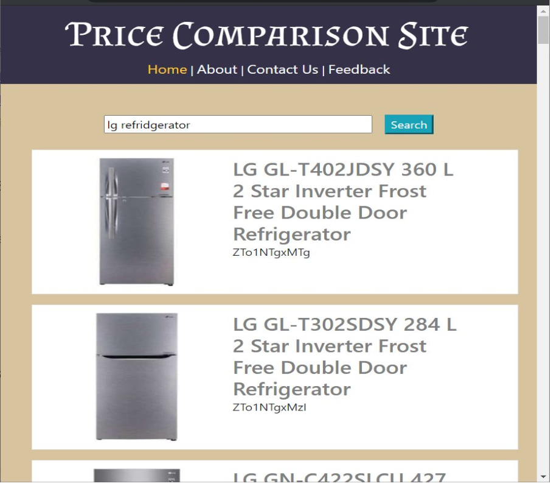
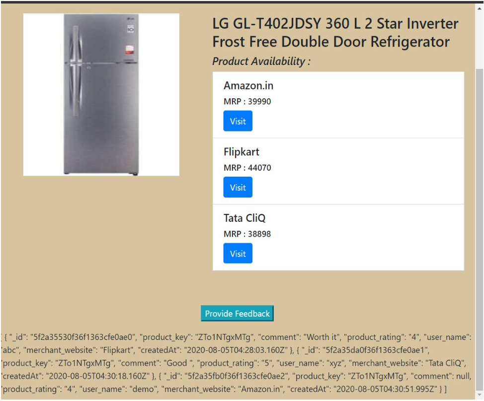

# site-compare-with-express
Following project is price comparison project, which compares product with diffrent websites for price, and give user a choice to select the 
product with less price. this project uses datayuge API for fetching the price and website information. also code is built for APSIT-Internship 
programm in a one weak time, hence further advancment are not done, and refactoring is also remaining. this project succesfully able to pass the 
criteria presented in internship, the built time for this project was around 10 days.

# output screenshots

  
  

